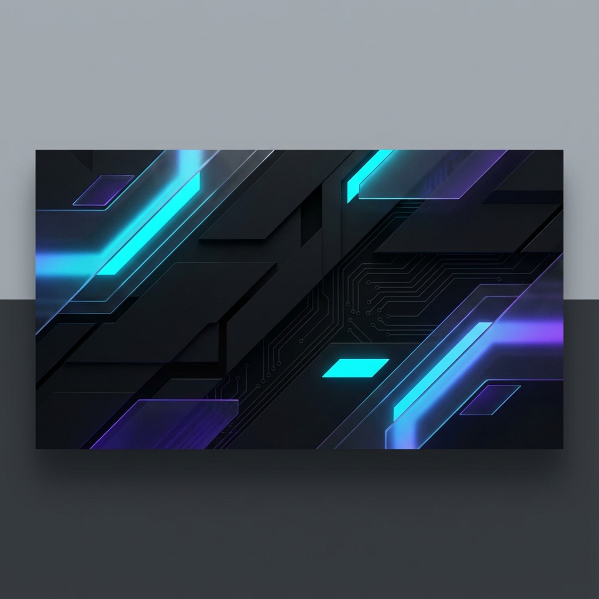

<div align="center">
  

  # Kaushal Portfolio
  
  [](https://react.dev/)
  [](https://www.typescriptlang.org/)
  [](https://vitejs.dev/)
  [](https://tailwindcss.com/)
  [](https://deepmind.google/technologies/gemini/)

  <p align="center">
    <b>A high-performance, visually stunning portfolio built for the modern web.</b>
    <br />
    <br />
    <a href="http://localhost:3000">View Demo</a>
    ·
    <a href="https://github.com/kaushalrnc0/kaushal-portfolio/issues">Report Bug</a>
    ·
    <a href="https://github.com/kaushalrnc0/kaushal-portfolio/pulls">Request Feature</a>
  </p>
</div>

<br />

## 🚀 Overview

**Kaushal Portfolio** is a cutting-edge personal website designed to showcase professional achievements, technical expertise, and creative projects. Built with a focus on performance, accessibility, and modern aesthetics, it leverages the power of **React 19**, **TypeScript**, and **Tailwind CSS**.

Integrated with **Google Gemini AI**, this portfolio offers dynamic, intelligent interactions, setting a new standard for developer portfolios.

## ✨ Key Features

- **🎨 Modern Data-Driven UI**: specific design system built with React and Tailwind CSS for a sleek, responsive interface.
- **🌓 Dark/Light Mode**: Seamless theming with smooth transitions, respecting user preferences.
- **⚡ Lightning Fast**: Powered by Vite for instant HMR and optimized production builds.
- **🤖 AI Integration**: Utilizes Google GenAI SDK for smart, interactive content and features.
- **📱 Fully Responsive**: customized mobile-first architecture ensuring perfect rendering on all devices.
- **♿ Accessibility First**: Adheres to modern web accessibility standards (WCAG).
- **📝 Project Showcase**: Interactive project gallery with detailed modals and live previews.

## 🛠️ Tech Stack

| Component | Technology | Description |
|-----------|------------|-------------|
| **Frontend** | [](https://react.dev/) | Library for building user interfaces |
| **Language** | [](https://www.typescriptlang.org/) | Typed superset of JavaScript |
| **Styling** | [](https://tailwindcss.com/) | Utility-first CSS framework |
| **Icons** | [](https://lucide.dev/) | Beautiful & consistent icon set |
| **Build Tool** | [](https://vitejs.dev/) | Next Generation Frontend Tooling |
| **AI** | [](https://deepmind.google/) | Advanced AI model integration |

## 💻 Getting Started

Follow these steps to set up the project locally.

### Prerequisites

- [Node.js](https://nodejs.org/en/) (v18.0.0 or higher)
- [npm](https://www.npmjs.com/) (v9.0.0 or higher)

### Installation

1. **Clone the repository**
   ```bash
   git clone https://github.com/kaushalrnc0/kaushal-portfolio.git
   cd kaushal-portfolio
   ```

2. **Install dependencies**
   ```bash
   npm install
   ```

3. **Configure Environment Variables**
   Create a `.env.local` file in the root directory and add your Gemini API key:
   ```env
   GEMINI_API_KEY=your_api_key_here
   ```

4. **Start the Development Server**
   ```bash
   npm run dev
   ```
   Visit `http://localhost:5173` to view the app.

## 🤝 Contributing

Contributions are what make the open source community such an amazing place to learn, inspire, and create. Any contributions you make are **greatly appreciated**.

1. Fork the Project
2. Create your Feature Branch (`git checkout -b feature/AmazingFeature`)
3. Commit your Changes (`git commit -m 'Add some AmazingFeature'`)
4. Push to the Branch (`git push origin feature/AmazingFeature`)
5. Open a Pull Request

## 📄 License

Distributed under the MIT License. See `LICENSE` for more information.

## 📬 Contact

**Kaushal Raj Gupta**

[](https://linkedin.com/in/kaushal-raj-gupta)
[](https://github.com/kaushalrnc0)
[](mailto:kaushal@example.com)

---

<div align="center">
  Made with ❤️ by Kaushal Raj Gupta
</div>
